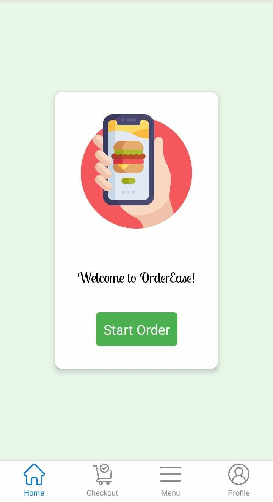
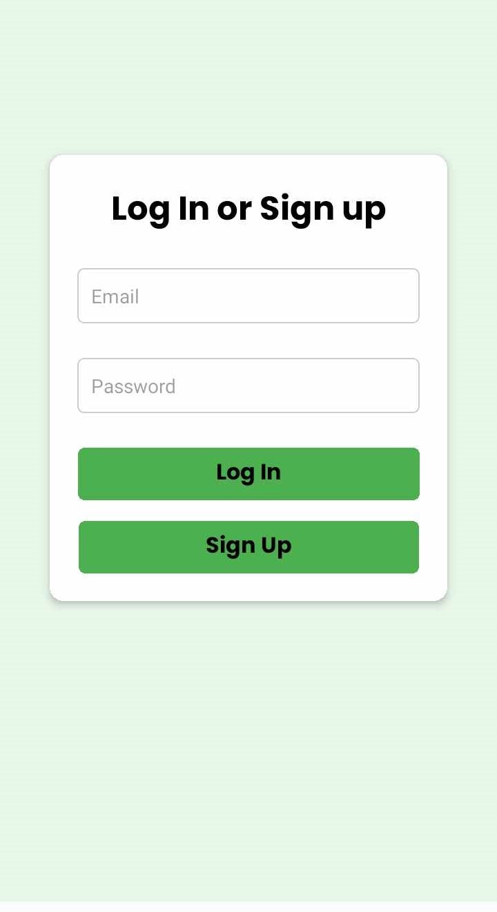
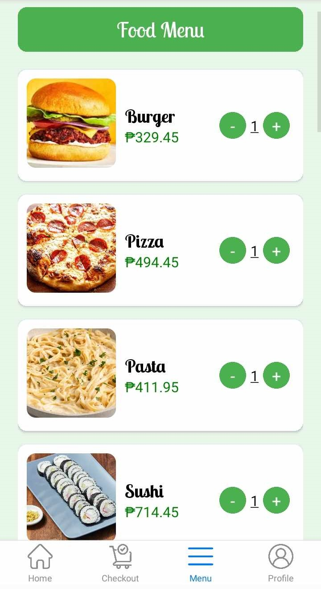
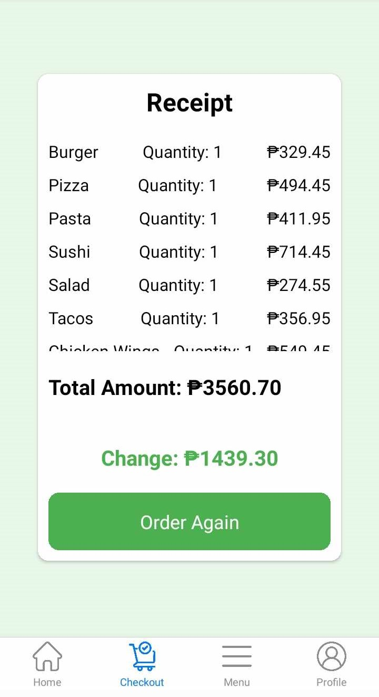
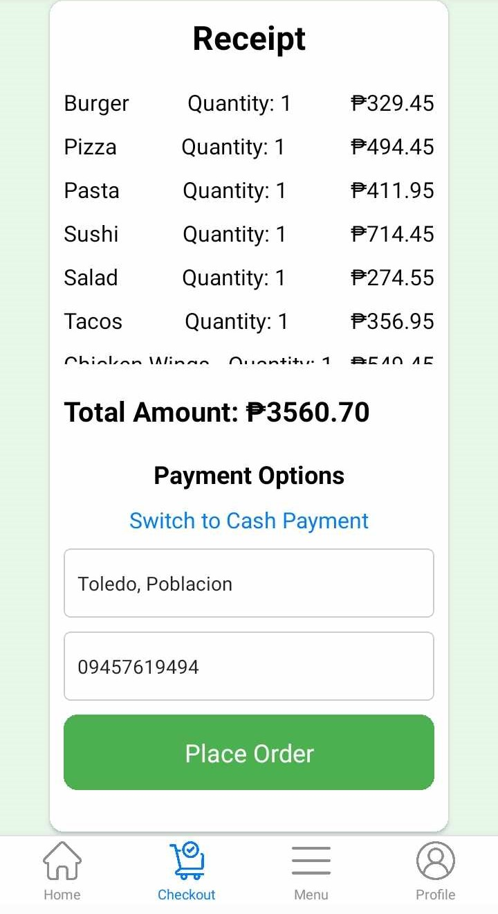
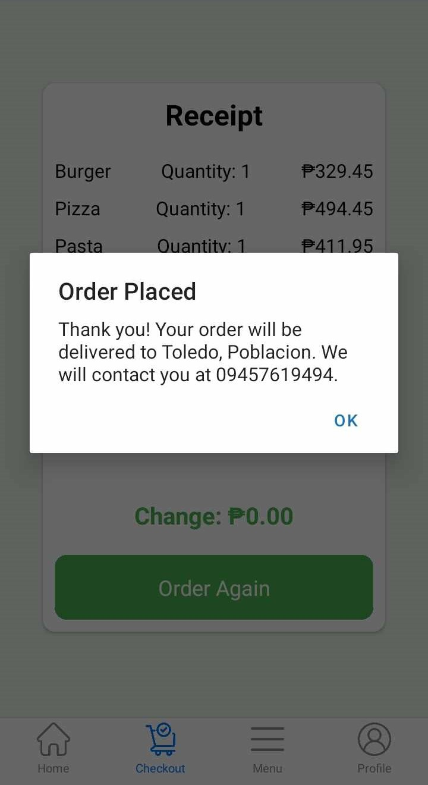

# EaseOrder
FoodOrder Mobile App.

## Features
* Create account
* Log in
* Sign up
* Browse Food Menu
* Order Food
* Cash on Delivery
* Online Payment

## Course Overview
* Basic React Native Components
* Database Design using Firebase
* User Registration & Authentication
* Order Processing and Tracking
* Deployment

## Tech Stack
* React Native
* HTML, Tailwind, and JavaScript

## Home Screen
  

## Sign In Screen
  

## Menu Screen

## Order Summary Screen

## Order Summary Screen COD

## Order Placed Screen

